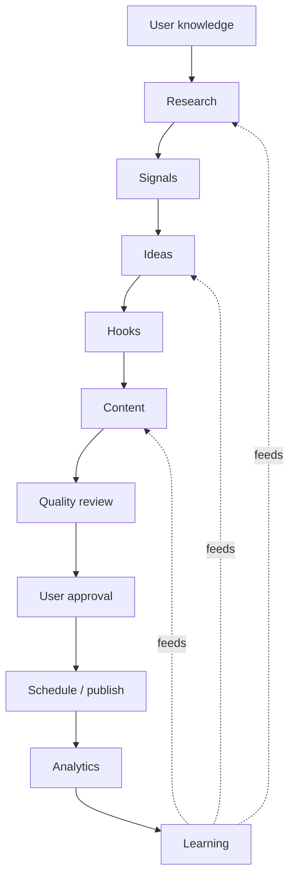
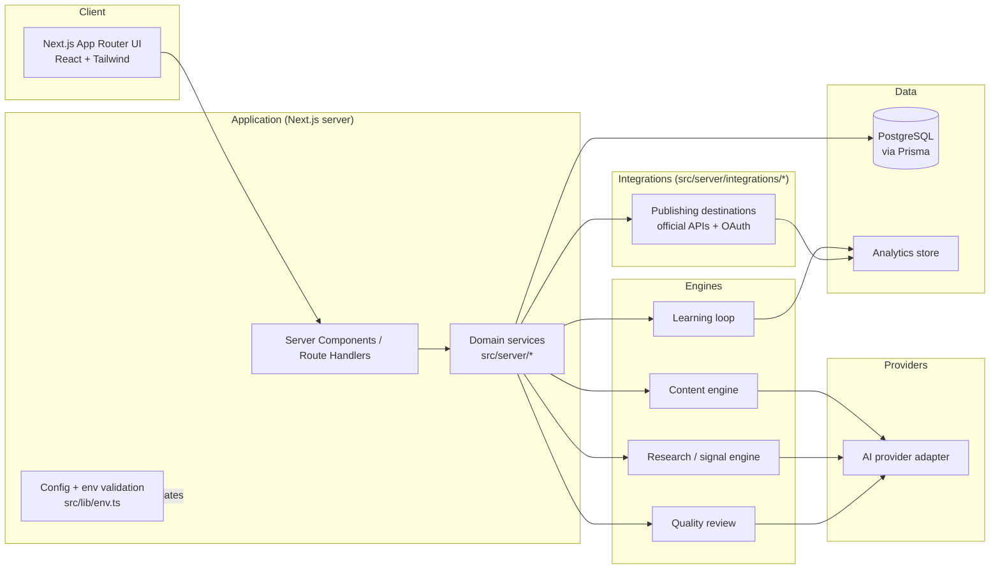

# LinkToGlobe.ai — Architecture

Status: **Phase 1 (Core MVP) + first slice of Phase 2 (research).** This document
describes the target design. Only the parts marked _implemented_ exist today;
everything else is a boundary we are building toward.

## 1. Goals and constraints

- Support the full content pipeline (below) without tightly coupling stages.
- Keep a human approval gate before any external publish — structurally, not by
  convention.
- Stay a single deployable app until scale genuinely forces otherwise.
- Make the AI provider and each publishing integration swappable.

## 2. The pipeline

Stage order is defined once in `src/lib/pipeline.ts` (_implemented_) and
referenced by the database enum, the UI, and these docs.

## 3. System architecture

## 4. Major modules

| Module                          | Path                        | Responsibility                                                 | Status                     |
| ------------------------------- | --------------------------- | -------------------------------------------------------------- | -------------------------- |
| Frontend                        | `src/app`, `src/components` | App Router UI, layout, design system                           | implemented                |
| Config / env                    | `src/lib/env.ts`            | Zod-validated environment, server/client split                 | implemented                |
| Pipeline model                  | `src/lib/pipeline.ts`       | Stage + lifecycle definitions                                  | implemented                |
| Database                        | `prisma/`, `src/lib/db.ts`  | Schema, migrations, Prisma client                              | implemented                |
| Auth                            | `src/server/auth`           | scrypt hashing, signed-cookie sessions, guards                 | implemented                |
| Knowledge                       | `src/server/knowledge`      | Capture the user's professional context                        | implemented                |
| Content service + state machine | `src/server/content`        | CRUD, `Idea → draft` seed, server-enforced lifecycle           | implemented                |
| Quality engine                  | `src/server/quality`        | Deterministic pre-publish checks                               | implemented                |
| AI provider layer               | `src/server/ai`             | One adapter (`manual`/`anthropic`/`openai`/`gemini`), advisory | implemented                |
| Analytics                       | `src/server/analytics`      | Real counts, approval rate, activity feed                      | Phase-1 subset             |
| Research / signal engine        | `src/server/research`       | Provider search, dedupe, clustering, signals, relevance, ideas | Phase-2 first slice        |
| Integrations                    | `src/server/integrations/*` | Publishing destinations behind one interface                   | planned (Phase 4)          |
| Automation                      | `src/server/automation`     | Scheduling, recurring jobs                                     | planned (Phase 5)          |
| Security / audit                | `src/server/*`, ActivityLog | AuthZ per query, append-only lifecycle log                     | basic; hardened in Phase 6 |

## 5. Data flow (target)

1. User submits knowledge / preferences → stored in Postgres.
2. Research + signal engines produce candidate material (attributed sources).
3. Content engine turns approved ideas into drafts via the AI adapter.
4. Quality review annotates each draft; state moves `DRAFT → QUALITY_CHECK`.
5. Draft enters the approval queue (`USER_APPROVAL`). A human decides.
6. On approval, the scheduler hands the draft to an integration to publish.
7. The integration and analytics module record outcomes.
8. The learning loop aggregates outcomes and feeds research / ideas / drafting.

State for a single item is tracked by `ApprovalState` (`prisma/schema.prisma` /
`APPROVAL_LIFECYCLE` in `src/lib/pipeline.ts`).

## 6. Integration boundaries

Every external service is optional. The app runs with none configured, and each
one reports its state on `/settings/integrations`. Credentials are environment
variables only; no client SDK is imported outside its own folder.

- **Registry** (`src/server/integrations/`) — a declaration of each connection
  (id, category, required env vars, capabilities, safety notes) plus
  `listIntegrations()`, which checks env presence only and never calls out.
  `implemented: false` marks a boundary whose client code is future work.
- **AI provider** (`src/server/ai/`, _implemented_) — one `AiProvider` interface
  (`suggestIdeas`, `suggestHook`, `expandDraft`, `review`) with `manual`
  (default, no-op), `anthropic`, `openai`, and `gemini` implementations selected
  by `AI_PROVIDER`. Output is advisory and never applied without a user action.
- **Research provider** (`src/server/research/`, _implemented_) — a
  vendor-neutral `ResearchProvider` interface with a typed error taxonomy.
  Adapters: `tavily`, `google` (Programmable Search), and a dev/test `fixture`.
  The domain layer (dedupe, clustering, signals, relevance) is deterministic and
  provider-independent. Search runs and the derived analysis are persisted
  per-user. Licensed APIs only, no scraping. See `src/server/research/README`
  in the module comments.
- **Publishing (LinkedIn)** (_boundary only_) — official OAuth + API only.
  A common `Integration` interface (`authorize`, `publish`, `fetchMetrics`,
  `revoke`) lands with the first destination. A post is reported published only
  when the API confirms it.
- **Email (Gmail / Outlook)** (_boundary only_) — official OAuth. Sending
  requires explicit user approval.
- **Company & people data** (_boundary only_) — licensed data source only.
  Contact details are never fabricated.
- **Calendar (Google / Outlook)** (_boundary only_) — optional, official OAuth.
- **Analytics** — written through one module so the backing store can change.

## 7. Security boundaries

- **Network:** the browser talks only to the Next.js app. Engines, providers,
  and integrations are server-side.
- **Secrets:** environment variables, read only on the server through
  `getServerEnv()`. Client code may read only `getClientEnv()` (`NEXT_PUBLIC_*`).
- **Publish gate:** the transition into `PUBLISH` is only reachable from
  `USER_APPROVAL` and requires an authenticated human action. Enforced by the
  publishing service and covered by tests when built.
- **Least privilege:** each integration holds only the OAuth scopes it needs;
  tokens are encrypted at rest (Phase 4).
- **Audit:** approval and publish actions are recorded in an append-only log
  (Phase 6).

See `SECURITY.md` for the full policy.
