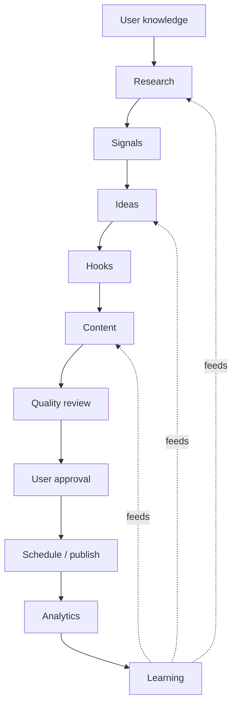
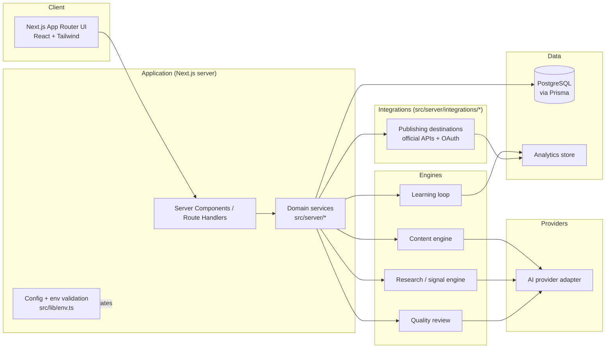

# LinkToGlobe — Architecture

Status: **Phase 0 (Foundation).** This document describes the target design.
Only the parts marked _implemented_ exist today; everything else is a boundary
we are building toward.

## 1. Goals and constraints

- Support the full content pipeline (below) without tightly coupling stages.
- Keep a human approval gate before any external publish — structurally, not by
  convention.
- Stay a single deployable app until scale genuinely forces otherwise.
- Make the AI provider and each publishing integration swappable.

## 2. The pipeline

Stage order is defined once in `src/lib/pipeline.ts` (_implemented_) and
referenced by the database enum, the UI, and these docs.

## 3. System architecture

## 4. Major modules

| Module                   | Path (target)               | Responsibility                                   | Phase                   |
| ------------------------ | --------------------------- | ------------------------------------------------ | ----------------------- |
| Frontend                 | `src/app`, `src/components` | App Router UI, layout, design system             | 0 _(shell implemented)_ |
| Config / env             | `src/lib/env.ts`            | Zod-validated environment, server/client split   | 0 _(implemented)_       |
| Pipeline model           | `src/lib/pipeline.ts`       | Stage + lifecycle definitions                    | 0 _(implemented)_       |
| Database                 | `prisma/`, `src/lib/db.ts`  | Schema, migrations, Prisma client                | 1 _(schema drafted)_    |
| Auth                     | `src/server/auth`           | Sessions, user identity                          | 1                       |
| Domain services          | `src/server/*`              | Orchestrate pipeline stages                      | 1+                      |
| AI provider layer        | `src/server/ai`             | One adapter, provider-agnostic                   | 2                       |
| Content engine           | `src/server/content`        | Ideas → hooks → drafts                           | 2                       |
| Research / signal engine | `src/server/research`       | Sources, signal detection                        | 2                       |
| Quality review           | `src/server/quality`        | Accuracy / originality / policy checks           | 2                       |
| Analytics                | `src/server/analytics`      | Ingest + aggregate performance data              | 3                       |
| Integrations             | `src/server/integrations/*` | Publishing destinations behind one interface     | 4                       |
| Automation               | `src/server/automation`     | Scheduling, recurring jobs                       | 5                       |
| Security / audit         | cross-cutting               | AuthZ, audit log, rate limiting, secret handling | all; hardened in 6      |

## 5. Data flow (target)

1. User submits knowledge / preferences → stored in Postgres.
2. Research + signal engines produce candidate material (attributed sources).
3. Content engine turns approved ideas into drafts via the AI adapter.
4. Quality review annotates each draft; state moves `DRAFT → QUALITY_CHECK`.
5. Draft enters the approval queue (`USER_APPROVAL`). A human decides.
6. On approval, the scheduler hands the draft to an integration to publish.
7. The integration and analytics module record outcomes.
8. The learning loop aggregates outcomes and feeds research / ideas / drafting.

State for a single item is tracked by `ApprovalState` (`prisma/schema.prisma` /
`APPROVAL_LIFECYCLE` in `src/lib/pipeline.ts`).

## 6. Future integration boundaries

- **AI provider:** a single interface (`generate`, `embed`, `review`) with
  per-provider implementations selected by env config. No provider SDK is
  imported outside `src/server/ai`.
- **Publishing integrations:** a common `Integration` interface
  (`authorize`, `publish`, `fetchMetrics`, `revoke`). Each lives in its own
  folder, is feature-flagged, and is disableable without touching core code.
  Only official APIs and OAuth are permitted (see `SECURITY.md`).
- **Analytics:** written through one module so the backing store can change.

## 7. Security boundaries

- **Network:** the browser talks only to the Next.js app. Engines, providers,
  and integrations are server-side.
- **Secrets:** environment variables, read only on the server through
  `getServerEnv()`. Client code may read only `getClientEnv()` (`NEXT_PUBLIC_*`).
- **Publish gate:** the transition into `PUBLISH` is only reachable from
  `USER_APPROVAL` and requires an authenticated human action. Enforced by the
  publishing service and covered by tests when built.
- **Least privilege:** each integration holds only the OAuth scopes it needs;
  tokens are encrypted at rest (Phase 4).
- **Audit:** approval and publish actions are recorded in an append-only log
  (Phase 6).

See `SECURITY.md` for the full policy.
